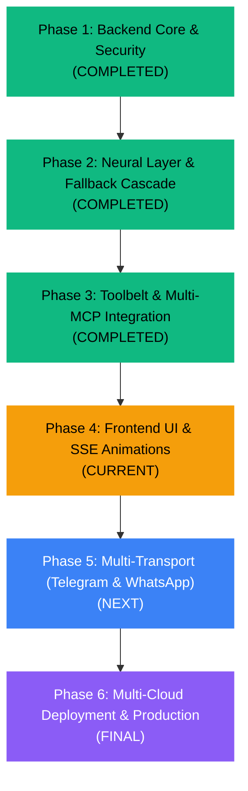

# 🗺️ Autonomous Personal Agent — Strategic Roadmap

This document outlines the strategic vision, architectural roadmap, and feature progression for the Autonomous Personal Agent.

---

## 🧭 Strategic Vision

To build an industry-grade, autonomous AI digital proxy that seamlessly handles portfolio interactions for public visitors, provides long-term assistance for registered users, and serves as an unrestricted personal command center for the administrator across Web, Telegram, and WhatsApp.

---

## 🗺️ Roadmap Phases

---

## 📌 Detailed Phase Breakdown

### Phase 1: Core Foundation & Security (Completed)
- **FastAPI REST API**: Asynchronous endpoints with unified error handling and standardized JSON envelopes.
- **Repository Pattern**: Strict isolation of SQLAlchemy queries into dedicated repositories (`SessionRepository`, `MessageRepository`, `MemoryRepository`).
- **AES-256-GCM Encryption**: Message payload encryption at rest with randomized 12-byte nonces.
- **PGVector Knowledge Base**: Neon PostgreSQL vector store with Google GenAI Embeddings (`models/text-embedding-004`).

### Phase 2: Dual-Brain Neural Engine & Resilience (Completed)
- **LangGraph State Machine**: DAG-based routing, intent classification, and tool-execution loops.
- **Dual-Brain Architecture**: Thinker (fast routing/conversational) + Reasoner (deep reasoning/tools).
- **Global Sweep Key Rotation**: Multi-tier cascade with multi-key rotation and breaker auto-reset.
- **Dynamic Fallback to Thinker**: Graceful apology and conversational diversion when reasoning engines exhaust.
- **Anti-Looping Protection**: Graph-level circuit breaker to prevent repeated tool calls.
- **JSON Schema Sanitizer**: Recursive sanitization for cross-provider function-calling compatibility.

### Phase 3: Agentic Toolbelt (Completed)
- **Portfolio & Profile Tools**: Live data extraction from portfolio database, GitHub, and LeetCode.
- **General Tools**: Weather (Open-Meteo), Wikipedia, Web Search (DuckDuckGo), GitHub Repo reader.
- **Admin Notifications**: Telegram & WhatsApp push notifications via custom endpoints.
- **Verification Suite**: Automated scripts in `scratch/` for full-cascade mock testing and tool execution.

### Phase 4: Frontend Chat Interface & Micro-Animations (In Progress)
- **Next.js 16 App Router UI**: Clean modern design system with Tailwind CSS and Radix UI.
- **Server-Sent Events (SSE)**: Real-time token streaming with live tool-execution feedback.
- **Long-Running Request Animations**: Rich micro-animations and thinking spinners during complex multi-step reasoning.
- **Session Management**: Ephemeral storage for public visitors and persistent Omni-Memory for authenticated users.

### Phase 5: Multi-Transport Integrations (Upcoming)
- **Telegram Bot**: Dual-Brain agent accessible directly via Telegram with admin-only tool authorizations.
- **WhatsApp Bot**: Low-latency mobile access via CallMeBot / Meta Cloud API.
- **Unified Identity**: Seamless conversation context shared between web and mobile chat.

### Phase 6: Production Hardening & Deployment (Upcoming)
- **Frontend Hosting**: Vercel deployment with edge caching and environment segregation.
- **Backend Hosting**: Render / Fly.io containerized deployment with health checks.
- **Database & Vectors**: Neon.tech serverless PostgreSQL with automated connection pooling.
- **Continuous Monitoring**: Structured logging, Sentry error tracking, and system degradation dashboards.
