# 🧠 Personal Agent 2.0 — System Design & Architecture

> **This is not a chatbot. It's an autonomous agent that happens to speak through a chat interface.**
>
> A chatbot answers questions. An agent **decides**, **acts**, **remembers**, and **orchestrates**. This project is the latter — a LangGraph-powered digital proxy that can advocate for you to recruiters, manage your email, scrape your GitHub stats in real-time, encrypt every conversation, and eventually run your entire digital life across Web, Telegram, and WhatsApp.

---

## Table of Contents

1. [The Philosophy: Agent vs Chatbot](#1-the-philosophy-agent-vs-chatbot)
2. [High-Level System Architecture](#2-high-level-system-architecture)
3. [The Portfolio Integration Model](#3-the-portfolio-integration-model)
4. [Backend: Domain-Driven Deep Dive](#4-backend-domain-driven-deep-dive)
5. [The Neural Layer — LangGraph State Machine](#5-the-neural-layer--langgraph-state-machine)
6. [The Agentic Toolbelt — 9 Autonomous Tools](#6-the-agentic-toolbelt--9-autonomous-tools)
7. [Omni-Memory — Encryption, Persistence & Recall](#7-omni-memory--encryption-persistence--recall)
8. [RAG Pipeline — Grounded Knowledge Retrieval](#8-rag-pipeline--grounded-knowledge-retrieval)
9. [Resilience & Data Engineering Patterns](#9-resilience--data-engineering-patterns)
10. [Security Architecture — RBAC, Auth & Encryption](#10-security-architecture--rbac-auth--encryption)
11. [Multi-Transport Layer — Web, Telegram, WhatsApp](#11-multi-transport-layer--web-telegram-whatsapp)
12. [Frontend: Admin Console & Chat Interface](#12-frontend-admin-console--chat-interface)
13. [Data Model — Entity Relationship Diagram](#13-data-model--entity-relationship-diagram)
14. [End-to-End Request Lifecycle](#14-end-to-end-request-lifecycle)
15. [Observability & Error Architecture](#15-observability--error-architecture)
16. [MCP — Model Context Protocol Integration](#16-mcp--model-context-protocol-integration)
17. [Future Vision — The Complete Roadmap](#17-future-vision--the-complete-roadmap)
18. [Technology Stack Matrix](#18-technology-stack-matrix)

---

## 1. The Philosophy: Agent vs Chatbot

Most portfolio "chatbots" are glorified FAQ bots. They pattern-match keywords and spit out pre-written answers. This project is fundamentally different — it's built on the principle that **an AI agent should be an autonomous decision-maker**, not a parrot.

### What Makes This an Agent

| Dimension | Traditional Chatbot | This Agent |
|-----------|-------------------|------------|
| **Decision Making** | Rule-based matching | LLM autonomously decides which tools to call |
| **Actions** | Returns text only | Executes real operations (DB writes, API calls, email sending) |
| **Memory** | Session-scoped, plaintext | Encrypted, cross-session, preference-extracted, summarized |
| **Routing** | Single path | LangGraph DAG with conditional edges and intent classification |
| **Security** | API key check | RBAC at the LLM node level, AES-256-GCM encryption at rest |
| **Transports** | Web widget only | Web + Telegram + WhatsApp (future) — same brain, multiple bodies |
| **Knowledge** | Static prompts | Live RAG from PGVector + real-time API tool calls |
| **Self-awareness** | None | Knows what page the user is viewing, navigates their browser |

### The Tri-Tier Architecture

The system operates across three strictly segregated tiers, ensuring that public users, authenticated agent users, and the system administrator are completely isolated:

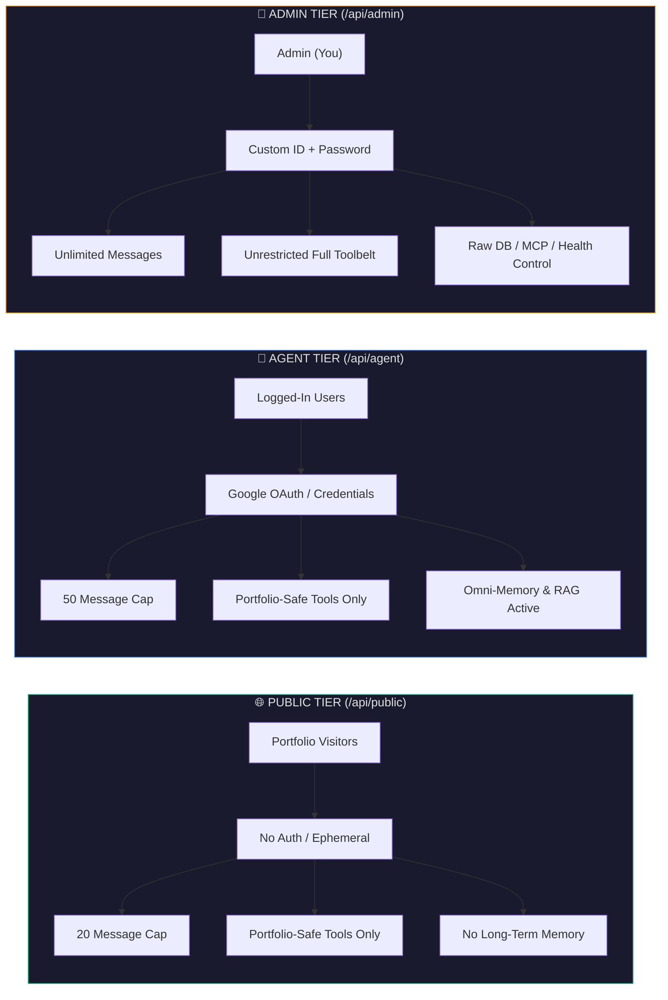

> [!IMPORTANT]
> The mode isn't just a UI switch — it's enforced at the **Routing and LangGraph node level**. Tools tagged `requires_admin` are physically removed from the LLM's awareness before invocation. Normal users literally cannot trigger admin tools through prompt injection because the model doesn't know they exist. Furthermore, physical API route segregation guarantees normal users cannot reach admin endpoints.
---

## 2. High-Level System Architecture

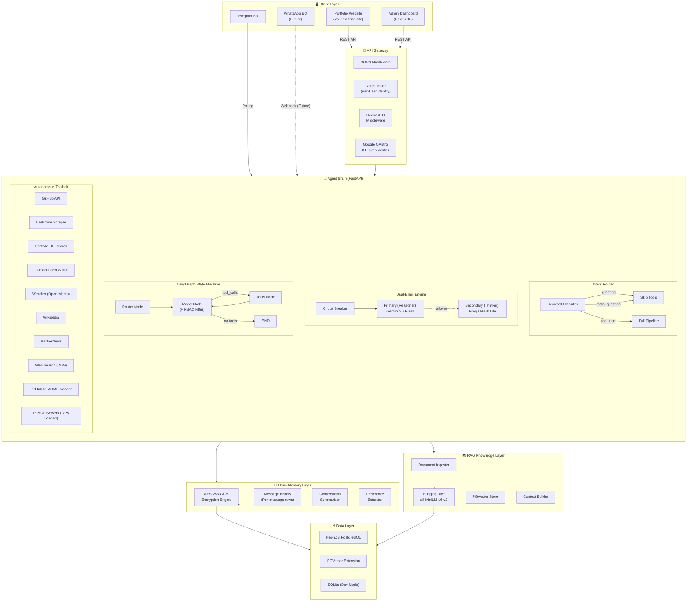

### Key Architectural Decisions

1. **Single Brain, Multiple Bodies** — The agent core (`process_user_message()`) is transport-agnostic. Web, Telegram, and WhatsApp all feed into the same function. Only session IDs and auth differ.

2. **Unified Data Layer** — No MongoDB for users, ChromaDB for vectors, Redis for cache. Everything (users, messages, vectors, memories, contacts, projects) lives in one PostgreSQL instance. One backup, one source of truth.

3. **Domain-Driven Design** — The HTTP layer ([api/](file:///d:/projects/personal_agent/backend/app/api)) knows nothing about LangGraph. The agent layer ([agent/](file:///d:/projects/personal_agent/backend/app/agent)) knows nothing about HTTP. Clean separation of concerns enforced structurally.

---

## 3. The Portfolio Integration Model

This is the critical piece — how this agent becomes the brain behind your portfolio website.

### How It Works

Your portfolio website (the existing one) will make REST API calls to this agent's backend. The agent replaces any existing chatbot with a fully autonomous system that:

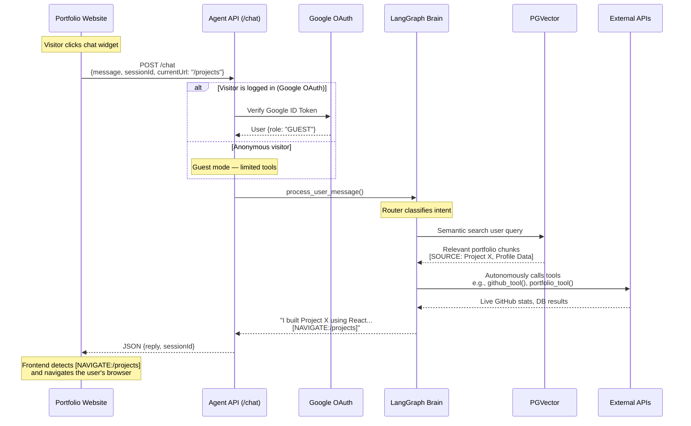

### Integration Points

| Your Portfolio Needs | Agent Provides |
|---------------------|----------------|
| Chat widget UI | Your existing widget calls `POST /chat` with `{message, sessionId, currentUrl}` |
| "Tell me about your projects" | RAG searches PGVector → returns grounded answers with citations |
| "Show me your GitHub stats" | Agent autonomously calls `github_tool()` → formats live data |
| "I want to hire you" | Agent autonomously calls `contact_tool()` → saves lead to DB |
| Page-aware responses | `currentUrl` field tells the agent what page the visitor sees |
| Browser navigation | Agent emits `[NAVIGATE:/projects]` tokens → your frontend navigates |
| Session continuity | `sessionId` maintains conversation history across page reloads |

### What Your Portfolio Frontend Needs to Do

1. **Embed a chat widget** that sends `POST /chat` requests to the agent API
2. **Pass `currentUrl`** (e.g., `/projects`, `/contact`) so the agent knows the context
3. **Parse `[NAVIGATE:/path]`** tokens from responses and do `router.push(path)`
4. **Handle auth** — send Google ID token as `Authorization: Bearer <token>` for authenticated sessions
5. **Generate a `sessionId`** (`crypto.randomUUID()`) and persist it in localStorage

### The RAG Ingestion Pipeline

Before the agent can answer portfolio questions, your data needs to be embedded:

```mermaid
graph LR
    subgraph Source["📂 Portfolio Database"]
        S1["Profile<br/>(name, bio, skills)"]
        S2["Projects<br/>(title, description, techStack)"]
        S3["Journey<br/>(work history, education)"]
    end
    
    subgraph Pipeline["⚙️ Ingestion Pipeline"]
        F["Fetch from DB"]
        C["Chunk Text<br/>(1000 chars, 150 overlap)"]
        E["Embed via<br/>Google text-embedding-004"]
    end
    
    subgraph Store["💾 Vector Store"]
        PG["NeonDB PGVector<br/>portfolio_knowledge collection"]
    end
    
    Source --> F --> C --> E --> Store
    
    style Pipeline fill:#1a1a2e,stroke:#10b981
```

Run via: `python -m app.rag.ingester`

This is defined in [ingester.py](file:///d:/projects/personal_agent/backend/app/rag/ingester.py) — it connects to your portfolio database, pulls Profile/Projects/Journey data, chunks it with `RecursiveCharacterTextSplitter`, embeds with Google GenAI (`models/text-embedding-004`), and stores in PGVector.

---

## 4. Backend: Domain-Driven Deep Dive

The backend follows strict **Domain-Driven Design** — each layer has zero knowledge of the others.

```text
backend/app/
├── api/              # 🎯 Controller Layer — HTTP boundary
│   ├── agent.py      #    POST /chat, POST /chat/reset, GET /chat/history, PUT/DELETE /chat/message/{id}
│   ├── admin.py      #    Admin-only endpoints (DB inspection)
│   └── health.py     #    GET /health
│
├── agent/            # 🧠 Neural Layer — The Brain
│   ├── service.py    #    The orchestrator: loads context → invokes graph → persists
│   ├── llm.py        #    Dual-LLM factory (HuggingFace + Gemini)
│   ├── prompts.py    #    System persona & behavioral directives
│   ├── core/
│   │   ├── builder.py #   LangGraph StateGraph definition
│   │   ├── nodes.py   #   Router, Model, Tools nodes
│   │   └── state.py   #   AgentState TypedDict
│   └── tools/         #   9 autonomous tools
│       ├── github.py, github_repo.py, leetcode.py
│       ├── portfolio.py, contact.py
│       └── weather.py, wikipedia.py, hackernews.py, web_search.py
│
├── core/             # 🔒 System Infrastructure
│   ├── auth.py       #    Google OAuth2 ID token verification
│   ├── encryption.py #    AES-256-GCM encrypt/decrypt
│   ├── memory.py     #    Per-message history persistence (AsyncMessageHistory)
│   ├── summarizer.py #    Conversation summarization + preference extraction
│   ├── logger.py     #    Structured logging (categories: LLM, TOOL, MEMORY, CTRL, SYSTEM)
│   ├── exceptions.py #    Error hierarchy (ApiError, AgentError, RateLimitError...)
│   ├── responses.py  #    Standardized JSON response builder
│   ├── circuit_breaker.py # CLOSED/OPEN/HALF_OPEN state machine for failing services
│   ├── retry.py      #    Exponential backoff + jitter for transient failures
│   ├── cache.py      #    Thread-safe TTL cache with pattern-based invalidation
│   ├── rate_limiter.py #   Per-user, per-endpoint, per-resource rate limiting
│   └── degradation.py #   SystemHealth tracker with formal degradation levels
│
├── rag/              # 📚 Knowledge Retrieval
│   ├── ingester.py   #    Fetches portfolio data → chunks → embeds → stores in PGVector
│   ├── vector_store.py #  PGVector factory + Google GenAI embeddings (models/text-embedding-004)
│   └── context.py    #    Semantic search: query → top-4 chunks → formatted context
│
├── models/           # 💾 SQLAlchemy ORM (8 models)
│   ├── user.py       #    User (synced from NextAuth)
│   ├── agent_session.py # Session (role, transport, user_id)
│   ├── agent_message.py # Individual encrypted messages (with Vector column)
│   ├── agent_memory.py  # Persistent memories (preferences, facts, summaries)
│   ├── profile.py    #    Profile + SocialLinks
│   ├── project.py    #    Portfolio projects
│   └── contact.py    #    Contact form submissions
│
├── repositories/     # 🏛️ Repository Pattern (DB centralization)
│   ├── session_repo.py  # All AgentSession CRUD — singleton
│   ├── message_repo.py  # All AgentMessage CRUD — singleton
│   └── memory_repo.py   # All AgentMemory CRUD + cache — singleton
│
├── mcp/              # 🔌 Model Context Protocol
│   └── client.py     #    MCPManager — connects to MCP servers, discovers tools
│
├── schemas/          # ✅ Pydantic Validation
│   ├── agent.py      #    ChatRequest, ChatResponseData, EditMessageRequest, HistoryResponseData
│   └── admin.py      #    Admin operation schemas
│
├── middlewares/      # 🔧 HTTP Middleware
│   └── request_id.py #    UUID per-request for distributed tracing
│
├── transports/       # 🌐 Multi-Transport
│   └── telegram.py   #    Telegram bot (polling mode, whitelist auth)
│
├── main.py           # 🚀 FastAPI factory + lifespan (DB init, LLM init, Telegram boot)
├── config.py         # ⚙️ Pydantic Settings (validated from .env)
└── database.py       # 🗄️ SQLAlchemy async engine + session factory
```

> [!NOTE]
> Every file in this tree is fully implemented and working. This is not a skeleton — the DDD structure is enforced by actual code, not just empty directories.

---

## 5. The Neural Layer — LangGraph State Machine

This is the heart of the project. Instead of a dumb while-loop, the agent runs on a **compiled LangGraph directed graph**.

### The Graph

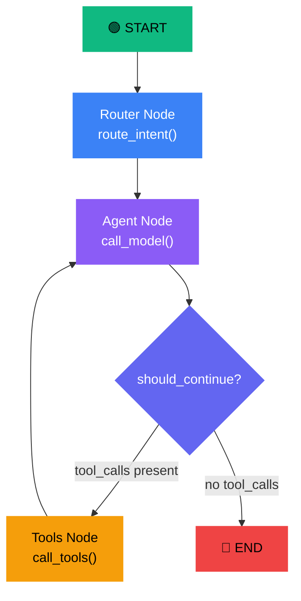

### Node Breakdown

#### 1. Router Node — [route_intent()](file:///d:/projects/personal_agent/backend/app/agent/core/nodes.py#L25-L58)
**Purpose**: Classify intent *before* the expensive LLM call.

```python
# Fast keyword match — zero LLM tokens spent
if cleaned in _GREETING_PATTERNS:   → intent: "greeting"      → routed to Thinker (no tools)
if pattern in _META_PATTERNS:       → intent: "meta_question"  → routed to Thinker (no tools)
if conversational:                  → intent: "conversational" → routed to Thinker (no tools)
else:                               → intent: "tool_use"       → routed to Reasoner (with tools)
```

**Why this matters**: A "hi" message costs $0.00 in tool-binding overhead instead of $0.01+. Over thousands of daily requests, this saves significant money.

#### 2. Agent Node — [call_model()](file:///d:/projects/personal_agent/backend/app/agent/core/nodes.py)
**Purpose**: Invoke the Dual-Brain LLM cascade with RBAC-filtered tools, Global Sweep key rotation, and dynamic fallback.

```
1. Filter tools by role → GUEST removes `requires_admin` tools.
2. If intent is greeting/meta/conversational → delegates to Brain 1 (Thinker) with slim messages and zero tools.
3. If intent is tool_use → delegates to Brain 2 (Reasoner) with sanitized messages and allowed tools.
4. Reasoner executes a Global Sweep across tiers (Gemini 3.5 Flash Lite -> Cohere Command-R+ -> Mistral Large).
   → If all fail and multiple Gemini keys exist, it rotates keys and sweeps again.
   → If anti-looping detects repetitive duplicate tool calls, it intercepts and yields text.
5. If Reasoner completely fails → dynamic fallback to Thinker with a hidden System Alert to apologize gracefully and offer alternative explorations.
6. If Thinker also fails → returns Layer 6 static fallback response.
7. Return AIMessage (possibly with tool_calls).
```

#### 3. Tools Node — [call_tools()](file:///d:/projects/personal_agent/backend/app/agent/core/nodes.py#L155-L223)
**Purpose**: Execute whatever tools the LLM decided to call, with retry for transient failures.

```
1. Extract tool_calls from AIMessage
2. For each call: look up tool by name → execute with retry_with_backoff (2 attempts, 0.5s base)
3. On permanent failure → return error ToolMessage (agent explains gracefully)
4. Return ToolMessages back to graph → flows back to Agent Node for synthesis
```

#### 4. Conditional Edge — [should_continue()](file:///d:/projects/personal_agent/backend/app/agent/core/builder.py#L16-L25)
```python
if last_message has tool_calls → route to "tools"
else → route to END
```

### The State Object — [AgentState](file:///d:/projects/personal_agent/backend/app/agent/core/state.py)

```python
class AgentState(TypedDict):
    messages: list[BaseMessage]    # Full conversation (system + history + new)
    session_id: str                # For memory persistence
    user_id: str | None            # For ownership + RBAC
    role: str                      # "GUEST" or "ADMIN"
    current_url: str | None        # What page the user is viewing
    intent: str                    # "tool_use", "greeting", "meta_question"
    summary: str | None            # Injected session summary from memory
```

---

## 6. The Agentic Toolbelt & MCP Integration

The agent autonomously decides which tools to call based on the user's question. The LLM sees the tool schemas and makes the decision — there's no hardcoded routing.

### Currently Implemented

| Tool | File | API Source | Key Feature |
|------|------|-----------|-------------|
| **GitHub Profile** | [github.py](file:///d:/projects/personal_agent/backend/app/agent/tools/github.py) | GitHub REST API | Fetches live follower count, repos, recent 5 events (pushes, PRs, stars) |
| **GitHub README** | [github_repo.py](file:///d:/projects/personal_agent/backend/app/agent/tools/github_repo.py) | GitHub API | Reads raw README.md of any repo for technical deep-dives |
| **LeetCode Stats** | [leetcode.py](file:///d:/projects/personal_agent/backend/app/agent/tools/leetcode.py) | LeetCode GraphQL | Scrapes solved count, ranking, difficulty breakdown |
| **Portfolio Search** | [portfolio.py](file:///d:/projects/personal_agent/backend/app/agent/tools/portfolio.py) | Local PostgreSQL | SQL `LIKE` search across projects by title/description/techStack |
| **Contact Form** | [contact.py](file:///d:/projects/personal_agent/backend/app/agent/tools/contact.py) | Local PostgreSQL | Writes sanitized (bleach) contact submissions directly to DB |
| **Weather** | [weather.py](file:///d:/projects/personal_agent/backend/app/agent/tools/weather.py) | Open-Meteo (free) | Geocodes city → fetches current + 3-day forecast with WMO codes |
| **Wikipedia** | [wikipedia.py](file:///d:/projects/personal_agent/backend/app/agent/tools/wikipedia.py) | Wikipedia API | Knowledge lookup for general questions |
| **HackerNews** | [hackernews.py](file:///d:/projects/personal_agent/backend/app/agent/tools/hackernews.py) | HN Algolia API | Searches trending tech stories |
| **Web Search** | [web_search.py](file:///d:/projects/personal_agent/backend/app/agent/tools/web_search.py) | DuckDuckGo API | General web search fallback (free, no API key) |

### Tool Design Pattern

Every tool follows the same pattern:

```python
@tool
async def my_tool(param: str) -> str:
    """Docstring becomes the tool description the LLM sees."""
    try:
        async with httpx.AsyncClient(timeout=10.0) as client:
            # 1. Call external API
            # 2. Parse response
            # 3. Format for LLM consumption (text, not JSON)
        return formatted_result
    except httpx.TimeoutException:
        return "Service timed out. Tell the user to try again."
    except Exception as e:
        return f"Error: {e}"
```

> [!TIP]
> Tools return **plain text**, not JSON. The LLM needs human-readable output to synthesize natural responses. The contact tool is the exception — it returns JSON because the agent needs to know `success: true/false` to inform the user.

### Tool Registration — [tools/__init__.py](file:///d:/projects/personal_agent/backend/app/agent/tools/__init__.py)

```python
agent_tools = [
    github_tool, github_repo_tool, leetcode_tool,
    portfolio_tool, contact_tool,
    weather_tool, wikipedia_tool, hackernews_tool, web_search_tool,
]
```

Adding a new tool = create the file + add to this list. That's it.

---

## 7. Omni-Memory — Encryption, Persistence & Recall

The memory system is the most sophisticated part of this project. It operates on three levels:

### Memory Architecture

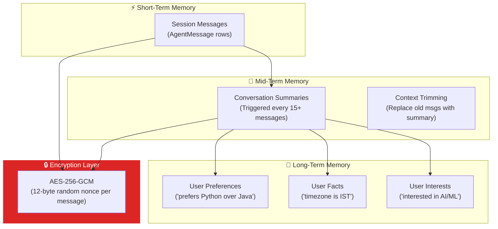

### Level 1: Per-Message Persistence — [memory.py](file:///d:/projects/personal_agent/backend/app/core/memory.py)

Every message is stored as an individual `AgentMessage` row (not a serialized JSON blob). This enables:
- **Granular deletion** — user can delete a single message
- **Message editing** — fix typos before re-running LangGraph
- **Semantic search** — each message has a `Vector(768)` column for future pgvector similarity queries

### Level 2: Conversation Summarization — [summarizer.py](file:///d:/projects/personal_agent/backend/app/core/summarizer.py)

After 15+ messages in a session, the system:
1. Sends the full conversation to the **cheaper fallback LLM** (Gemini)
2. Extracts a 2-4 sentence summary
3. Extracts user preferences with confidence scores
4. Stores both in `AgentMemory`
5. On future requests, trims old messages and injects the summary instead

### Level 3: Transparent Encryption — [encryption.py](file:///d:/projects/personal_agent/backend/app/core/encryption.py) + [EncryptedString](file:///d:/projects/personal_agent/backend/app/models/agent_message.py#L13-L30)

```python
# SQLAlchemy TypeDecorator — completely transparent
class EncryptedString(TypeDecorator):
    def process_bind_param(self, value, dialect):
        return encrypt_string(value)  # Auto-encrypt on save
    
    def process_result_value(self, value, dialect):
        return decrypt_string(value)  # Auto-decrypt on load
```

The `AgentMessage.content` and `AgentMessage.tool_calls` fields use this type. Application code reads/writes plaintext. The database stores AES-256-GCM ciphertext. Nobody even has to think about encryption — it's invisible.

### The Encryption Flow

```
plaintext → 12-byte random nonce → AES-256-GCM encrypt → base64(nonce + ciphertext) → DB
DB → base64 decode → extract nonce (first 12 bytes) → AES-256-GCM decrypt → plaintext
```

---

## 8. RAG Pipeline — Grounded Knowledge Retrieval

The RAG pipeline ensures the agent answers portfolio questions from **real data**, not hallucinations.

### Pipeline Components

| Component | File | Purpose |
|-----------|------|---------|
| **Vector Store Factory** | [vector_store.py](file:///d:/projects/personal_agent/backend/app/rag/vector_store.py) | Creates PGVector instance or returns `None` on SQLite |
| **Embeddings** | Same file | `GoogleGenerativeAIEmbeddings(model="models/text-embedding-004")` |
| **Document Ingester** | [ingester.py](file:///d:/projects/personal_agent/backend/app/rag/ingester.py) | Fetches Profile/Projects/Journey → chunks → embeds → stores |
| **Context Builder** | [context.py](file:///d:/projects/personal_agent/backend/app/rag/context.py) | `asimilarity_search(query, k=4)` → formatted context block |

### How RAG Feeds Into the Prompt

```python
# From service.py — every request triggers a RAG search
portfolio_context = await get_base_portfolio_context(query=message)

system_prompt = SystemMessage(content=(
    f"{SYSTEM_PERSONA}\n\n"
    f"{user_memories}"                           # Long-term memory
    f"[PORTFOLIO CONTEXT]\n{portfolio_context}\n" # RAG results
    f"[END CONTEXT]"
    f"{location_context}"                         # Current page URL
))
```

The agent is instructed to **cite sources**: `[SOURCE: Project Name]` — so users know where the information came from.

### Graceful Degradation

On SQLite (dev mode), RAG is automatically disabled via [vector_store.py](file:///d:/projects/personal_agent/backend/app/rag/vector_store.py):
```python
RAG_AVAILABLE = settings.is_postgres  # False on SQLite
```
The agent falls back to its tools (`portfolio_tool` does SQL `LIKE` search) instead of crashing.

---

## 9. Resilience & Data Engineering Patterns

To build an "Industry Grade" system, we rejected easy defaults in favor of highly resilient enterprise patterns.

### 🏛️ The Repository Pattern
*   **The Problem**: Mixing raw SQL/SQLAlchemy queries directly inside routes or business logic makes the codebase tightly coupled, hard to test, and difficult to refactor if the database schema changes.
*   **Our Solution**: Centralized repositories (`SessionRepository`, `MessageRepository`, `MemoryRepository`). All database access happens exclusively through these singletons. Routes and services only call repository methods.

### 🛡️ Resilience Layer (Dual-Brain Fallback Cascade & Global Sweep)
*   **Dual-Brain Architecture**:
    *   **Brain 1 (Thinker)**: Fast routing & greetings. Tier 1: Groq (`llama-3.1-8b-instant`) → Tier 2: Gemini (`gemini-3.1-flash-lite`, 500 RPD) → Tier 3: Mistral (`mistral-small-latest`).
    *   **Brain 2 (Reasoner)**: Deep reasoning with tools. Tier 1: Gemini (`gemini-3.5-flash-lite`, 500 RPD) → Tier 2: Cohere (`command-r-plus-08-2024`) → Tier 3: Mistral (`mistral-large-latest`).
*   **Global Sweep Key Rotation**: Rather than retrying a rate-limited tier immediately and burning keys, the orchestrator sweeps the full chain first. If all fail, it rotates multi-key providers (`GEMINI_API_KEY=key1,key2`) and runs a clean second sweep with auto-reset circuit breakers.
*   **Dynamic Thinker Fallback**: If the entire Reasoner cascade fails, the system passes an alert to the Thinker to dynamically apologize and offer alternatives without tool access.
*   **Anti-Looping Protection**: If a smaller fallback model repeats the identical tool call twice, the loop is intercepted, tool calls are stripped, and a safe text reply is yielded.
*   **Schema Sanitizer**: Recursively strips `oneOf`, `anyOf`, and stringifies integer `enum` arrays for 100% cross-provider function-calling compatibility.
*   **Circuit Breakers**: Independent breakers track failures per tier and trip to `OPEN` after threshold failures, recovering via `HALF_OPEN` auto-probes.
*   **Tier 6 (Static)**: Hardcoded local response (zero API dependency ultimate safety net).

### ⚡ Caching Layer (TTL Cache)
*   **The Problem**: Hitting the database for user preferences, session summaries, or history on every fast interaction is inefficient.
*   **Our Solution**: A thread-safe, in-memory `TTLCache`. Database reads hit the cache first. Writes to the database (saving summaries or messages) automatically invalidate the relevant cache patterns (e.g., `app_cache.delete("history:*")`).

### 🚦 Graceful Degradation
*   **System Health Tracker**: Continuously monitors the operational status of subcomponents (5 LLM Tiers, RAG, MCP Servers, Database).
*   **Status Levels**: The system dynamically shifts between `FULL`, `NO_RAG`, `NO_MCP`, `FALLBACK_LLM`, `DEGRADED`, and `UNAVAILABLE` (when running purely on the Layer 6 static fallback).

### 📉 Identity-Aware Rate Limiting & LLM Budgets
*   **Per-Endpoint Limits**: Protects expensive endpoints (like MCP reload or Chat) based on the user's role (ADMIN vs GUEST).
*   **Per-Resource LLM Budget**: Limits the total number of LLM token/tool invocations per hour globally, protecting against unexpected API bills.

---

## 10. Security Architecture — RBAC, Auth & Encryption

### Multi-Layer Security

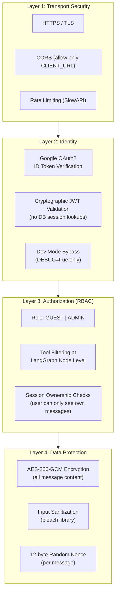

### Authentication Flow — [auth.py](file:///d:/projects/personal_agent/backend/app/core/auth.py)

```
1. Frontend authenticates via Google OAuth (NextAuth)
2. Frontend sends Google ID Token as: Authorization: Bearer <token>
3. Backend verifies token via google.oauth2.id_token.verify_oauth2_token()
   - Validates signature (Google's public keys)
   - Validates expiration
   - Validates issuer (accounts.google.com)
   - Validates audience (your client ID)
4. Extracts email, name, picture
5. Upserts User in database → returns User object
6. In DEBUG mode: no token → auto-creates "dev@localhost" admin user
```

### RBAC Implementation

```python
# In nodes.py — call_model()
allowed_tools = []
for t in agent_tools:
    if getattr(t, "requires_admin", False) and role != "ADMIN":
        continue  # Tool is physically invisible to the LLM
    allowed_tools.append(t)
```

### Session Ownership

Every CRUD operation on messages checks ownership:
```python
# Only the user who owns the session can read/edit/delete messages
if session.user_id != current_user.id:
    raise HTTPException(status_code=403)
```

---

## 11. Multi-Transport Layer — Web, Telegram, WhatsApp

### Transport Architecture

The genius of this design is that **all transports feed into the same brain**:

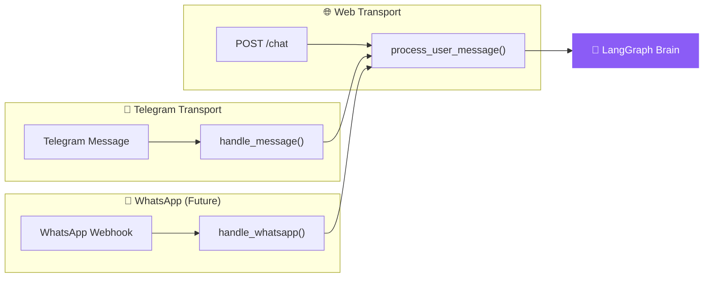

### Session ID Namespacing

```python
# Web: random UUID from frontend
session_id = body.sessionId  # e.g., "a1b2c3d4-..."

# Telegram: derived from Telegram chat ID
session_id = f"tg_chat_{chat.id}"  # e.g., "tg_chat_123456789"

# WhatsApp (future): derived from phone number
session_id = f"wa_{phone_number}"  # e.g., "wa_+919876543210"
```

This ensures memory isolation — your Telegram conversation never leaks into a web visitor's session.

### Telegram Implementation — [telegram.py](file:///d:/projects/personal_agent/backend/app/transports/telegram.py)

- **Auth**: Whitelist of allowed Telegram user IDs via `TELEGRAM_ALLOWED_USER_IDS`
- **Boot**: Starts polling in the FastAPI lifespan (startup event)
- **Typing indicator**: Sends `ChatAction.TYPING` while LLM processes
- **Error handling**: Graceful fallback to plain text if Markdown parsing fails

---

## 12. Frontend: Admin Console & Chat Interface

### Frontend Stack

| Technology | Version | Purpose |
|-----------|---------|---------|
| Next.js | 16 | SSR App Router |
| React | 19 | Component framework |
| Framer Motion | 12 | Cinema-grade animations |
| Tailwind CSS | 4 | Styling |
| NextAuth | v5 beta | Google OAuth |
| Zustand | 5 | State management |
| Lucide React | 0.453 | Icons |
| React Markdown | 8 | Render agent markdown responses |

### Component Architecture

```
frontend/
├── app/
│   ├── page.tsx          # Landing page (glassmorphism, animated gradients)
│   ├── layout.tsx        # Root layout with providers
│   ├── globals.css       # Design tokens
│   └── chat/             # Chat dashboard route
│
├── components/
│   ├── chat/
│   │   ├── ChatArea.tsx       # Message list with auto-scroll
│   │   ├── Composer.tsx       # Input bar with send button
│   │   ├── MessageBubble.tsx  # Individual message rendering (markdown)
│   │   └── ToolCallBadge.tsx  # Visual indicator when agent calls a tool
│   ├── layout/
│   │   ├── Sidebar.tsx        # Session list, new chat, settings
│   │   └── Header.tsx         # Top bar
│   ├── auth/
│   │   └── AuthButton.tsx     # Google OAuth sign in/out
│   └── ui/
│       ├── Icons.tsx          # Icon components
│       └── Skeleton.tsx       # Loading skeleton
│
├── store/
│   └── useAgentStore.ts  # Zustand store (messages, sessions, UI state)
├── hooks/
│   └── useAgentAPI.ts    # API client hooks (sendMessage, fetchSessions, resetSession)
└── utils/
    └── cn.ts             # clsx + tailwind-merge utility
```

### Key UI Features

- **Animated landing page** with mesh gradients and floating blur orbs
- **Glassmorphism navbar** with backdrop blur
- **Framer Motion** spring animations on every message (scale + translate)
- **Typing indicator** with pulsing dots
- **Session management** sidebar with session switching
- **Tool call badges** showing when the agent invoked external tools
- **Markdown rendering** in agent responses (code blocks, links, lists)

---

## 13. Data Model — Entity Relationship Diagram

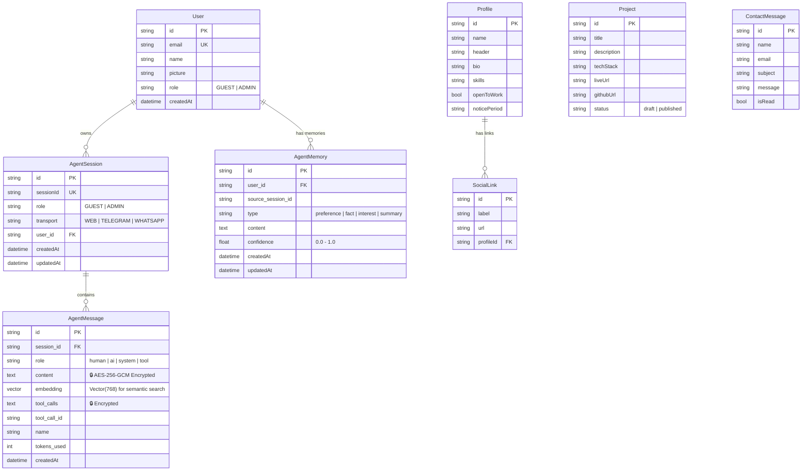

> [!IMPORTANT]
> The `AgentMessage.content` field is the most critical field in the system. It uses a custom `EncryptedString` SQLAlchemy TypeDecorator that transparently encrypts on write and decrypts on read. In the database, it's unreadable ciphertext. In application code, it's plaintext. Zero developer friction.

---

## 14. End-to-End Request Lifecycle

Here's exactly what happens when a user sends "What are your best projects?" through the portfolio chatbot:

```mermaid
sequenceDiagram
    participant U as User
    participant FE as Portfolio Frontend
    participant MW as Middleware Stack
    participant API as POST /chat
    participant AUTH as Auth Layer
    participant SVC as Agent Service
    participant MEM as Memory Manager
    participant RAG as RAG Context
    participant LG as LangGraph
    participant ROUTER as Router Node
    participant MODEL as Model Node
    participant TOOLS as Tools Node
    participant GH as GitHub API
    participant DB as NeonDB (Encrypted)

    U->>FE: Types "What are your best projects?"
    FE->>MW: POST /chat {message, sessionId, currentUrl: "/"}
    MW->>MW: Assign Request ID (UUID)
    MW->>MW: Check rate limit
    MW->>API: Forward request
    
    API->>AUTH: Verify Google ID Token
    AUTH-->>API: User {id, role: "GUEST"}
    
    API->>SVC: process_user_message(message, session_id, user_id)
    
    rect rgb(30, 30, 60)
        Note over SVC: Phase 1: Context Assembly
        SVC->>MEM: Load session history (auto-decrypted)
        MEM-->>SVC: 5 previous messages
        SVC->>MEM: Load user memories (preferences, facts)
        MEM-->>SVC: "User interested in React" (confidence: 0.8)
        SVC->>MEM: Load session summary (if exists)
        SVC->>RAG: Semantic search "best projects"
        RAG-->>SVC: 4 relevant chunks [SOURCE: Project X, Y, Z]
    end
    
    rect rgb(30, 50, 30)
        Note over SVC: Phase 2: LangGraph Execution
        SVC->>LG: Invoke with AgentState
        LG->>ROUTER: route_intent()
        ROUTER-->>LG: intent: "tool_use"
        LG->>MODEL: call_model() [RBAC: GUEST tools only]
        MODEL-->>LG: AIMessage with tool_calls: [portfolio_tool("React"), github_tool()]
        
        LG->>TOOLS: Execute portfolio_tool + github_tool
        TOOLS->>DB: SQL search projects
        TOOLS->>GH: GET /users/anurag-basuri/events
        DB-->>TOOLS: 2 React projects found
        GH-->>TOOLS: Recent GitHub activity
        TOOLS-->>LG: ToolMessages with results
        
        LG->>MODEL: Synthesize final answer
        MODEL-->>LG: "Here are my best projects! I built..."
    end
    
    rect rgb(50, 30, 30)
        Note over SVC: Phase 3: Persistence
        SVC->>MEM: Persist human message (encrypted)
        SVC->>MEM: Persist AI message (encrypted)
        SVC->>MEM: Persist tool messages (encrypted)
        
        Note over SVC: Check if summarization threshold reached
        SVC->>SVC: 18 total messages > 15 threshold
        SVC->>MODEL: Summarize via cheap LLM (Gemini)
        SVC->>DB: Store summary + extracted preferences
    end
    
    SVC-->>API: AgentResponse {reply, session_id}
    API-->>FE: JSON {success: true, data: {reply, sessionId}}
    FE-->>U: Renders markdown response with project cards
```

---

## 15. Observability & Error Architecture

### Structured Logging — [logger.py](file:///d:/projects/personal_agent/backend/app/core/logger.py)

Every operation is logged with category, timestamp, and structured metadata:

```
[2026-07-17 06:30:15] [INFO] [Agent:SYSTEM] ━━━ New Request (LangGraph) ━━━ | {"session_id": "abc...", "role": "GUEST"}
[2026-07-17 06:30:15] [INFO] [Agent:LLM] 🧠 Invoking HuggingFace (Qwen2.5-72B-Instruct)
[2026-07-17 06:30:16] [INFO] [Agent:TOOL] ⚡ Executing: portfolio_tool | {"args": {"query": "React"}}
[2026-07-17 06:30:16] [INFO] [Agent:TOOL] ✅ portfolio_tool completed | {"duration_ms": 45}
[2026-07-17 06:30:17] [INFO] [Agent:LLM] ✅ LLM responded | {"duration_ms": 1200, "tool_call_count": 0}
[2026-07-17 06:30:17] [INFO] [Agent:SYSTEM] ━━━ Request Complete ━━━ | {"total_duration_ms": 2100}
```

### Error Hierarchy — [exceptions.py](file:///d:/projects/personal_agent/backend/app/core/exceptions.py)

```
ApiError (base)
├── BadRequestError (400)
├── AuthenticationError (401)
├── ForbiddenError (403)
├── NotFoundError (404)
├── ConflictError (409)
├── RateLimitError (429)
├── AgentError (500)
├── ExternalServiceError (502)
└── ServiceUnavailableError (503)
```

Every error response includes:
- `success: false`
- `message` (user-facing, sanitized in production)
- `errors` (detail array)
- `request_id` (for tracing)
- `timestamp` (ISO 8601)

The generic exception handler automatically classifies database errors (`IntegrityError` → 409, `OperationalError` → 503), timeout errors (→ 504), and circuit breaker rejections (→ 503). A shared `classify_and_raise()` utility centralizes rate-limit and timeout detection across all routes.

---

## 16. MCP — Model Context Protocol Integration

The agent's toolbelt is dynamically extensible via MCP (Model Context Protocol). Instead of hardcoding all API integrations, the agent can connect to external or internal MCP servers.

### MCP Architecture

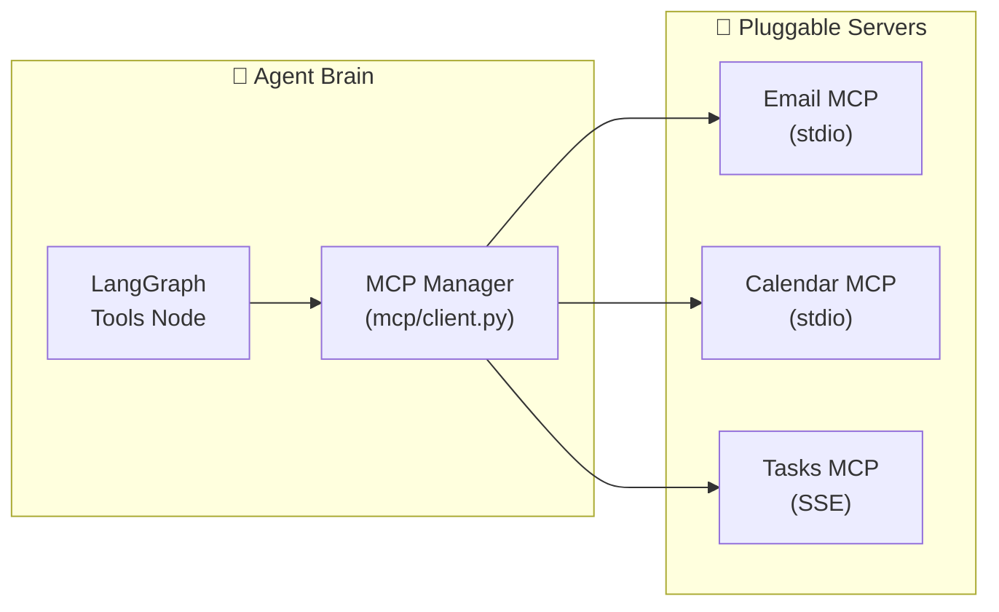

- **Dynamic Loading**: On startup, `MCPManager` reads a config file, boots the servers, and extracts their tool schemas.
- **Hot-Plugging**: Tools can be added or removed without redeploying the main FastAPI backend.
- **Decoupling**: The core agent doesn't need to know how to authenticate with Gmail or Calendar; the MCP servers handle their own credentials and return standardized tool responses.

---

## 17. Future Vision — The Complete Roadmap

### What's Built vs What's Coming

````carousel
### ✅ Implemented (~75% of Vision)

| System | Status |
|--------|--------|
| LangGraph State Machine | ✅ Full DAG with intent routing + conditional edges |
| Dual-Brain Fallback Cascade | ✅ Thinker (Groq → Flash Lite → Mistral) & Reasoner (Gemini 3.7 → Cohere → Mistral) → Static Fallback |
| 10 Built-in Agent Tools | ✅ GitHub, GitHub Repos, LeetCode, Portfolio, Contact, Weather, Wikipedia, Web Search, Notify |
| 17 MCP Servers | ✅ Vercel, Netlify, Render, GitHub, Google, Zomato, Swiggy x3, QuickCommerce, HackerNews, DDG, Sequential Thinking, Puppeteer, Postgres, Linear, Todoist, Notion |
| AES-256-GCM Encryption | ✅ Transparent via TypeDecorator |
| RAG Pipeline | ✅ Ingester + PGVector + semantic search + auto-sync |
| Telegram Bot | ✅ Polling mode with whitelist auth |
| WhatsApp Notifications | ✅ CallMeBot + unified notifier pipeline |
| Conversation Summarization | ✅ Auto-trigger at 15+ messages |
| Preference Extraction | ✅ With confidence scores |
| Google OAuth | ✅ ID token verification |
| RBAC at Node Level | ✅ Tool filtering by role |
| Structured Logging | ✅ ANSI colored, categorized, startup banner |
| Centralized Error Handling | ✅ 8 exception subclasses, DB mapping, production sanitization |
| Request Logging Middleware | ✅ Duration tracking + safety net |
| Granular Message CRUD | ✅ Edit/delete individual messages |
| Admin Dashboard | ✅ Next.js 16 with Framer Motion |
| Admin MCP Management | ✅ CRUD API + hot-reload |
| Resilience Layer | ✅ 5 Circuit Breakers, Retry, Degradation |
| Caching | ✅ Thread-safe TTLCache with invalidation |
| Repository Pattern | ✅ Centralized DB access singletons |
| Custom Rate Limiting | ✅ Identity-aware & LLM budgeting |
| Cron Automation | ✅ Automation endpoint + test notifications |
<!-- slide -->
### 🔮 Coming Next

| Phase | System | What It Adds |
|-------|--------|-------------|
| **Phase 3** | **Email Agent** | Custom Gmail tools (read/send/draft), human-in-the-loop confirmation |
| **Phase 10** | **Google Workspace** | Complete OAuth flow, Calendar integration testing |
| **Frontend** | **Portfolio Widget** | Embed public chatbot into live portfolio website |
| **Frontend** | **Agent Website** | Connect Next.js to completed 3-way backend endpoints |
| **UX Polish** | **Rich UI** | Suggestion chips, rich cards, typing indicators, onboarding |
| **Streaming** | **SSE Responses** | Stream LLM output for perceived speed |
````

### The Ultimate Vision

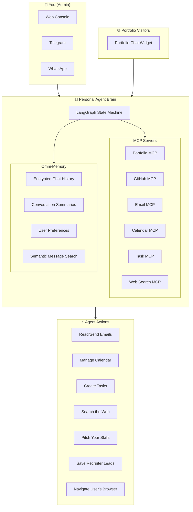

### The End State

When complete, this is what the agent does:

**For portfolio visitors (recruiters, clients)**:
> "Tell me about Anurag's experience with React" → Agent searches RAG + GitHub + portfolio DB → presents grounded answer with citations → offers to navigate to the projects page → if they want to hire you, collects their info and saves it as a lead.

**For you (authenticated admin)**:
> "Summarize my inbox, draft a reply to the Google recruiter, and block 2pm-3pm on my calendar for that meeting" → Agent reads Gmail → summarizes → drafts reply → waits for your confirmation → sends → books calendar event → saves task "Follow up with Google recruiter" for next week.

---

## 18. Technology Stack Matrix

| Layer | Technology | Why This Over Alternatives |
|-------|-----------|---------------------------|
| **Backend Framework** | FastAPI + Uvicorn | Async-native, auto OpenAPI docs, Python ecosystem for AI |
| **Agent Framework** | LangGraph | DAG-based, not while-loop. Supports HITL, checkpointing, conditional routing |
| **Primary LLM** | Gemini 3.7 Flash & Groq | Dual-brain setup for cost/speed optimization |
| **Fallback LLM** | Google Gemini 2.5 Flash | Fast, cheap, reliable. Used for summarization too |
| **Embeddings** | HuggingFace all-MiniLM-L6-v2 | Free, local-runnable, PGVector integrated |
| **Vector Store** | NeonDB + PGVector | Same DB as relational data → no orphaned vectors, single backup |
| **ORM** | SQLAlchemy 2.0 (async) | Type-safe, async, custom TypeDecorators for encryption |
| **Encryption** | cryptography (AES-256-GCM) | Military-grade, nonce-based, no key reuse |
| **Auth** | Google OAuth2 + NextAuth v5 | Stateless JWT verification, no session DB queries |
| **Frontend** | Next.js 16 + React 19 | App Router, SSR, React Server Components |
| **Animations** | Framer Motion 12 | Spring physics, layout animations, AnimatePresence |
| **Styling** | Tailwind CSS 4 | Utility-first, fast iteration |
| **State Management** | Zustand 5 | Minimal boilerplate, devtools, no context hell |
| **Transport** | python-telegram-bot 21 | Official async library, full Telegram API |
| **Rate Limiting** | Custom Sliding Window | Identity-aware, per-endpoint, and LLM budgeting |
| **Input Sanitization** | bleach 6 | Prevents XSS in user-submitted content |
| **HTTP Client** | httpx | Async, timeout support, connection pooling |
| **Validation** | Pydantic v2 | Runtime type checking, .env validation, schema generation |

---

> [!NOTE]
> This document describes the system as it exists in code today. Every "implemented" claim has a direct file reference you can click to verify.
